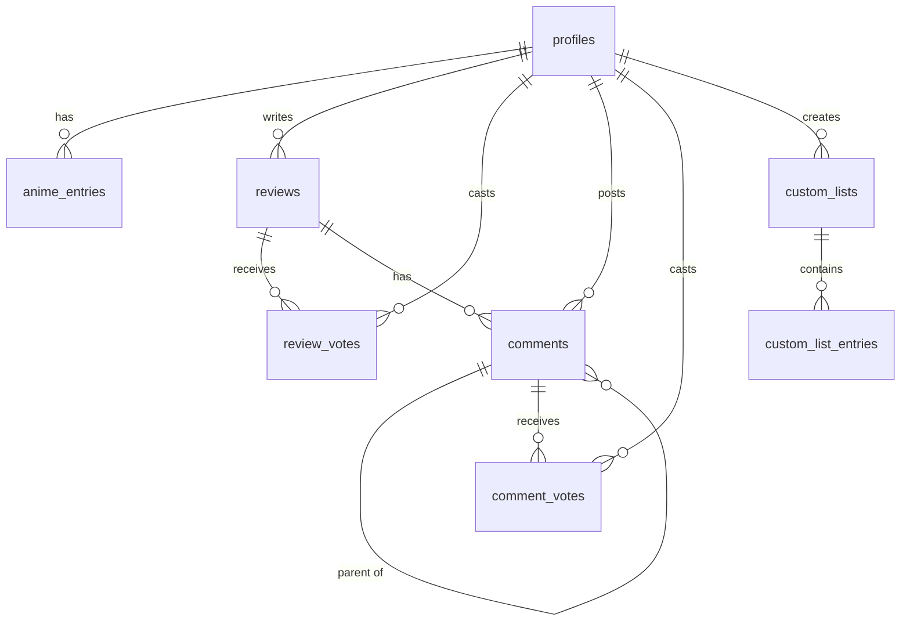

## Overview

AniDojo uses Supabase (PostgreSQL) for data storage with Row Level Security (RLS) enabled for all tables. The schema supports anime tracking, reviews, comments, custom lists, and user profiles.

## Core Tables

### profiles

Extends Supabase Auth users with additional profile information.

<ResponseField name="id" type="UUID" required>
  Primary key, references `auth.users(id)` with CASCADE delete
</ResponseField>

<ResponseField name="username" type="TEXT" required>
  Unique username for the user
</ResponseField>

<ResponseField name="avatar_url" type="TEXT">
  URL to user's avatar image in storage
</ResponseField>

<ResponseField name="bio" type="TEXT">
  User biography/description
</ResponseField>

<ResponseField name="created_at" type="TIMESTAMPTZ" required>
  Timestamp when profile was created (default: NOW())
</ResponseField>

<ResponseField name="updated_at" type="TIMESTAMPTZ" required>
  Timestamp when profile was last updated (auto-updated by trigger)
</ResponseField>

**Constraints:**
- Primary Key: `id`
- Unique: `username`
- Foreign Key: `id` → `auth.users(id)` ON DELETE CASCADE

**Indexes:**
- Primary key index on `id`

---

### anime_entries

Stores user's anime list entries with watch status, progress, and ratings.

<ResponseField name="id" type="UUID" required>
  Primary key, auto-generated with `uuid_generate_v4()`
</ResponseField>

<ResponseField name="user_id" type="UUID" required>
  References `profiles(id)` with CASCADE delete
</ResponseField>

<ResponseField name="anime_id" type="INTEGER" required>
  ID from external anime API (e.g., Jikan/MyAnimeList)
</ResponseField>

<ResponseField name="title" type="TEXT" required>
  Primary title of the anime
</ResponseField>

<ResponseField name="title_english" type="TEXT">
  English title translation
</ResponseField>

<ResponseField name="title_japanese" type="TEXT">
  Original Japanese title
</ResponseField>

<ResponseField name="image" type="TEXT">
  URL to anime cover image
</ResponseField>

<ResponseField name="type" type="TEXT">
  Anime type (TV, Movie, OVA, etc.)
</ResponseField>

<ResponseField name="episodes" type="INTEGER">
  Total number of episodes
</ResponseField>

<ResponseField name="status" type="TEXT" required>
  Watch status. Must be one of:
  - `watching`
  - `completed`
  - `on-hold`
  - `dropped`
  - `plan-to-watch`
</ResponseField>

<ResponseField name="episodes_watched" type="INTEGER" required>
  Number of episodes watched (default: 0)
</ResponseField>

<ResponseField name="score" type="INTEGER">
  User rating from 1-10
</ResponseField>

<ResponseField name="start_date" type="DATE">
  Date when user started watching
</ResponseField>

<ResponseField name="finish_date" type="DATE">
  Date when user finished watching
</ResponseField>

<ResponseField name="notes" type="TEXT">
  Personal notes about the anime
</ResponseField>

<ResponseField name="tags" type="TEXT[]" required>
  Custom tags (default: empty array)
</ResponseField>

<ResponseField name="favorite" type="BOOLEAN" required>
  Whether anime is marked as favorite (default: false)
</ResponseField>

<ResponseField name="rewatch_count" type="INTEGER" required>
  Number of times rewatched (default: 0)
</ResponseField>

<ResponseField name="priority" type="TEXT">
  Priority level: `low`, `medium`, or `high`
</ResponseField>

<ResponseField name="genres" type="TEXT[]" required>
  Anime genres (default: empty array)
</ResponseField>

<ResponseField name="year" type="INTEGER">
  Release year
</ResponseField>

<ResponseField name="rating" type="TEXT">
  Content rating (G, PG, PG-13, R, etc.)
</ResponseField>

<ResponseField name="created_at" type="TIMESTAMPTZ" required>
  Timestamp when entry was created (default: NOW())
</ResponseField>

<ResponseField name="updated_at" type="TIMESTAMPTZ" required>
  Timestamp when entry was last updated (auto-updated by trigger)
</ResponseField>

**Constraints:**
- Primary Key: `id`
- Unique: `(user_id, anime_id)` - one entry per user per anime
- Foreign Key: `user_id` → `profiles(id)` ON DELETE CASCADE
- Check: `status` IN ('watching', 'completed', 'on-hold', 'dropped', 'plan-to-watch')
- Check: `score` BETWEEN 1 AND 10
- Check: `priority` IN ('low', 'medium', 'high')

**Indexes:**
- `idx_anime_entries_user_id` on `user_id`
- `idx_anime_entries_anime_id` on `anime_id`
- `idx_anime_entries_status` on `status`

---

### reviews

Detailed anime reviews with ratings, recommendations, and draft support.

<ResponseField name="id" type="UUID" required>
  Primary key, auto-generated with `uuid_generate_v4()`
</ResponseField>

<ResponseField name="user_id" type="UUID" required>
  References `profiles(id)` with CASCADE delete
</ResponseField>

<ResponseField name="anime_id" type="INTEGER" required>
  ID from external anime API
</ResponseField>

<ResponseField name="rating" type="INTEGER" required>
  Overall rating from 1-10
</ResponseField>

<ResponseField name="story_rating" type="INTEGER">
  Story/plot rating from 1-10
</ResponseField>

<ResponseField name="animation_rating" type="INTEGER">
  Animation quality rating from 1-10
</ResponseField>

<ResponseField name="sound_rating" type="INTEGER">
  Sound/music rating from 1-10
</ResponseField>

<ResponseField name="character_rating" type="INTEGER">
  Character development rating from 1-10
</ResponseField>

<ResponseField name="enjoyment_rating" type="INTEGER">
  Personal enjoyment rating from 1-10
</ResponseField>

<ResponseField name="title" type="TEXT" required>
  Review title/headline
</ResponseField>

<ResponseField name="body" type="TEXT" required>
  Full review text content
</ResponseField>

<ResponseField name="spoilers" type="BOOLEAN" required>
  Whether review contains spoilers (default: false)
</ResponseField>

<ResponseField name="watch_status" type="TEXT" required>
  Watch status when review was written:
  - `completed`
  - `watching`
  - `dropped`
  - `plan-to-watch`
</ResponseField>

<ResponseField name="episodes_watched" type="INTEGER">
  Episodes watched at time of review
</ResponseField>

<ResponseField name="tags" type="TEXT[]" required>
  Review tags (default: empty array)
</ResponseField>

<ResponseField name="pros" type="TEXT">
  Positive aspects of the anime
</ResponseField>

<ResponseField name="cons" type="TEXT">
  Negative aspects of the anime
</ResponseField>

<ResponseField name="recommendation" type="TEXT">
  Recommendation level:
  - `highly-recommend`
  - `recommend`
  - `mixed`
  - `not-recommend`
  - `strongly-not-recommend`
</ResponseField>

<ResponseField name="status" type="TEXT" required>
  Publication status: `draft` or `published` (default: draft)
</ResponseField>

<ResponseField name="helpful_votes" type="INTEGER" required>
  Net helpful votes count (default: 0, auto-updated by trigger)
</ResponseField>

<ResponseField name="created_at" type="TIMESTAMPTZ" required>
  Timestamp when review was created (default: NOW())
</ResponseField>

<ResponseField name="updated_at" type="TIMESTAMPTZ" required>
  Timestamp when review was last updated (auto-updated by trigger)
</ResponseField>

**Constraints:**
- Primary Key: `id`
- Foreign Key: `user_id` → `profiles(id)` ON DELETE CASCADE
- Check: `rating` BETWEEN 1 AND 10
- Check: `story_rating`, `animation_rating`, `sound_rating`, `character_rating`, `enjoyment_rating` BETWEEN 1 AND 10
- Check: `watch_status` IN ('completed', 'watching', 'dropped', 'plan-to-watch')
- Check: `recommendation` IN ('highly-recommend', 'recommend', 'mixed', 'not-recommend', 'strongly-not-recommend')
- Check: `status` IN ('draft', 'published')
- Unique: `(user_id, anime_id)` WHERE `status = 'published'` (one published review per user per anime)

**Indexes:**
- `idx_reviews_user_id` on `user_id`
- `idx_reviews_anime_id` on `anime_id`
- `idx_reviews_status` on `status`
- `idx_reviews_user_anime_published` on `(user_id, anime_id)` WHERE `status = 'published'`

---

### review_votes

Tracks helpful/not helpful votes on reviews.

<ResponseField name="id" type="UUID" required>
  Primary key, auto-generated with `uuid_generate_v4()`
</ResponseField>

<ResponseField name="review_id" type="UUID" required>
  References `reviews(id)` with CASCADE delete
</ResponseField>

<ResponseField name="user_id" type="UUID" required>
  References `profiles(id)` with CASCADE delete
</ResponseField>

<ResponseField name="helpful" type="BOOLEAN" required>
  True for helpful vote, false for not helpful
</ResponseField>

<ResponseField name="created_at" type="TIMESTAMPTZ" required>
  Timestamp when vote was created (default: NOW())
</ResponseField>

**Constraints:**
- Primary Key: `id`
- Unique: `(review_id, user_id)` - one vote per user per review
- Foreign Key: `review_id` → `reviews(id)` ON DELETE CASCADE
- Foreign Key: `user_id` → `profiles(id)` ON DELETE CASCADE

**Indexes:**
- `idx_review_votes_review_id` on `review_id`
- `idx_review_votes_user_id` on `user_id`

---

### comments

Comments on reviews with support for threaded replies.

<ResponseField name="id" type="UUID" required>
  Primary key, auto-generated with `uuid_generate_v4()`
</ResponseField>

<ResponseField name="review_id" type="UUID" required>
  References `reviews(id)` with CASCADE delete
</ResponseField>

<ResponseField name="user_id" type="UUID" required>
  References `profiles(id)` with CASCADE delete
</ResponseField>

<ResponseField name="parent_id" type="UUID">
  References `comments(id)` with CASCADE delete for nested replies
</ResponseField>

<ResponseField name="content" type="TEXT" required>
  Comment text content
</ResponseField>

<ResponseField name="created_at" type="TIMESTAMPTZ" required>
  Timestamp when comment was created (default: NOW())
</ResponseField>

<ResponseField name="updated_at" type="TIMESTAMPTZ" required>
  Timestamp when comment was last updated (auto-updated by trigger)
</ResponseField>

<ResponseField name="deleted_at" type="TIMESTAMPTZ">
  Soft delete timestamp (null if not deleted)
</ResponseField>

**Constraints:**
- Primary Key: `id`
- Foreign Key: `review_id` → `reviews(id)` ON DELETE CASCADE
- Foreign Key: `user_id` → `profiles(id)` ON DELETE CASCADE
- Foreign Key: `parent_id` → `comments(id)` ON DELETE CASCADE

**Indexes:**
- `idx_comments_review_id` on `review_id`
- `idx_comments_user_id` on `user_id`
- `idx_comments_parent_id` on `parent_id`

---

### comment_votes

Upvote/downvote system for comments.

<ResponseField name="id" type="UUID" required>
  Primary key, auto-generated with `uuid_generate_v4()`
</ResponseField>

<ResponseField name="comment_id" type="UUID" required>
  References `comments(id)` with CASCADE delete
</ResponseField>

<ResponseField name="user_id" type="UUID" required>
  References `profiles(id)` with CASCADE delete
</ResponseField>

<ResponseField name="upvote" type="BOOLEAN" required>
  True for upvote, false for downvote
</ResponseField>

<ResponseField name="created_at" type="TIMESTAMPTZ" required>
  Timestamp when vote was created (default: NOW())
</ResponseField>

**Constraints:**
- Primary Key: `id`
- Unique: `(comment_id, user_id)` - one vote per user per comment
- Foreign Key: `comment_id` → `comments(id)` ON DELETE CASCADE
- Foreign Key: `user_id` → `profiles(id)` ON DELETE CASCADE

**Indexes:**
- `idx_comment_votes_comment_id` on `comment_id`

---

### custom_lists

User-created custom anime lists.

<ResponseField name="id" type="UUID" required>
  Primary key, auto-generated with `uuid_generate_v4()`
</ResponseField>

<ResponseField name="user_id" type="UUID" required>
  References `profiles(id)` with CASCADE delete
</ResponseField>

<ResponseField name="name" type="TEXT" required>
  List name/title
</ResponseField>

<ResponseField name="description" type="TEXT">
  List description
</ResponseField>

<ResponseField name="is_public" type="BOOLEAN" required>
  Whether list is publicly visible (default: false)
</ResponseField>

<ResponseField name="created_at" type="TIMESTAMPTZ" required>
  Timestamp when list was created (default: NOW())
</ResponseField>

<ResponseField name="updated_at" type="TIMESTAMPTZ" required>
  Timestamp when list was last updated (auto-updated by trigger)
</ResponseField>

**Constraints:**
- Primary Key: `id`
- Foreign Key: `user_id` → `profiles(id)` ON DELETE CASCADE

**Indexes:**
- `idx_custom_lists_user_id` on `user_id`

---

### custom_list_entries

Anime entries within custom lists.

<ResponseField name="id" type="UUID" required>
  Primary key, auto-generated with `uuid_generate_v4()`
</ResponseField>

<ResponseField name="list_id" type="UUID" required>
  References `custom_lists(id)` with CASCADE delete
</ResponseField>

<ResponseField name="anime_id" type="INTEGER" required>
  ID from external anime API
</ResponseField>

<ResponseField name="created_at" type="TIMESTAMPTZ" required>
  Timestamp when entry was added (default: NOW())
</ResponseField>

**Constraints:**
- Primary Key: `id`
- Unique: `(list_id, anime_id)` - one entry per anime per list
- Foreign Key: `list_id` → `custom_lists(id)` ON DELETE CASCADE

**Indexes:**
- `idx_custom_list_entries_list_id` on `list_id`

---

## Database Functions

### handle_new_user()

Automatically creates a profile when a new user signs up via Supabase Auth.

```sql
CREATE OR REPLACE FUNCTION public.handle_new_user()
RETURNS TRIGGER AS $$
BEGIN
  INSERT INTO public.profiles (id, username)
  VALUES (
    NEW.id,
    COALESCE(NEW.raw_user_meta_data->>'username', split_part(NEW.email, '@', 1))
  );
  RETURN NEW;
END;
$$ LANGUAGE plpgsql SECURITY DEFINER;
```

**Trigger:** Executes AFTER INSERT on `auth.users`

---

### handle_updated_at()

Automatically updates the `updated_at` timestamp on table updates.

```sql
CREATE OR REPLACE FUNCTION public.handle_updated_at()
RETURNS TRIGGER AS $$
BEGIN
  NEW.updated_at = NOW();
  RETURN NEW;
END;
$$ LANGUAGE plpgsql;
```

**Triggers:** Executes BEFORE UPDATE on:
- `profiles`
- `anime_entries`
- `reviews`
- `comments`
- `custom_lists`

---

### update_review_helpful_votes()

Automatically maintains the `helpful_votes` count on reviews based on votes.

```sql
CREATE OR REPLACE FUNCTION public.update_review_helpful_votes()
RETURNS TRIGGER AS $$
BEGIN
  UPDATE public.reviews
  SET helpful_votes = (
    SELECT COUNT(*) FILTER (WHERE helpful = true) - COUNT(*) FILTER (WHERE helpful = false)
    FROM public.review_votes
    WHERE review_id = COALESCE(NEW.review_id, OLD.review_id)
  )
  WHERE id = COALESCE(NEW.review_id, OLD.review_id);
  RETURN COALESCE(NEW, OLD);
END;
$$ LANGUAGE plpgsql;
```

**Triggers:** Executes AFTER INSERT, UPDATE, DELETE on `review_votes`

---

## Row Level Security (RLS)

All tables have RLS enabled with the following policies:

### profiles
- **SELECT:** Anyone can view all profiles
- **INSERT:** Users can insert their own profile
- **UPDATE:** Users can update only their own profile

### anime_entries
- **SELECT:** Users can view only their own entries
- **INSERT:** Users can insert only their own entries
- **UPDATE:** Users can update only their own entries
- **DELETE:** Users can delete only their own entries

### reviews
- **SELECT:** Anyone can view published reviews; users can view their own drafts
- **INSERT:** Users can insert their own reviews
- **UPDATE:** Users can update only their own reviews
- **DELETE:** Users can delete only their own reviews

### review_votes
- **SELECT:** Anyone can view all votes
- **INSERT:** Authenticated users can insert their own votes
- **UPDATE:** Users can update only their own votes
- **DELETE:** Users can delete only their own votes

### comments
- **SELECT:** Anyone can view non-deleted comments
- **INSERT:** Authenticated users can insert comments
- **UPDATE:** Users can update only their own comments
- **DELETE:** Users can delete only their own comments

### comment_votes
- **SELECT:** Anyone can view all votes
- **INSERT:** Authenticated users can insert their own votes
- **UPDATE:** Users can update only their own votes
- **DELETE:** Users can delete only their own votes

### custom_lists
- **SELECT:** Users can view public lists or their own private lists
- **INSERT:** Users can insert only their own lists
- **UPDATE:** Users can update only their own lists
- **DELETE:** Users can delete only their own lists

### custom_list_entries
- **SELECT:** Users can view entries for public lists or their own lists
- **INSERT:** Users can insert entries only to their own lists
- **DELETE:** Users can delete entries only from their own lists

---

## Relationships



---

## Migration File

The complete schema is defined in:
```
supabase/migrations/001_initial_schema.sql
```

See [SUPABASE_USAGE.md](/api/database/types#usage-examples) for usage examples.
